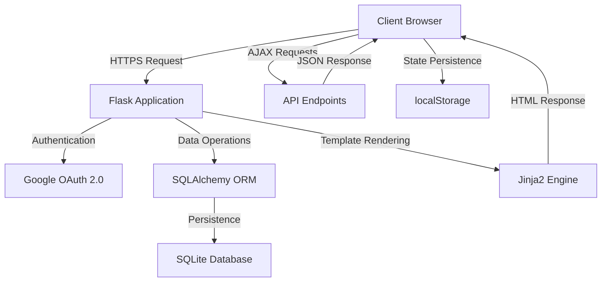

# 🎯 FocusFlow - Advanced Productivity Suite

<div align="center">


**A comprehensive web-based productivity application combining task management, Pomodoro technique, calendar integration, and AI assistance for optimal workflow optimization.**

[](https://python.org)
[](https://flask.palletsprojects.com/)
[](https://sqlite.org)
[](https://oauth.net/)

</div>

---

## 🌟 Overview

FocusFlow is a sophisticated productivity suite that integrates multiple proven productivity methodologies into a single, cohesive platform. Built with modern web technologies, it combines task management, the Pomodoro Technique, calendar visualization, and AI-powered assistance to create an optimal environment for focused work and productivity tracking.

### 🎯 Key Highlights
- **🔒 Enterprise-grade security** with Google OAuth 2.0 authentication
- **⏱️ Advanced Pomodoro timer** with persistent state and statistics tracking
- **📊 Real-time productivity analytics** and session management
- **🤖 AI-powered assistant** for productivity guidance
- **🎮 Gamified break activities** to encourage proper rest periods
- **📱 Fully responsive design** for cross-device compatibility

---

## ✨ Comprehensive Feature Set

### 🎯 **Advanced Task Management System**
- **Smart Task Creation**: Comprehensive form validation with date constraints and error handling
- **Intelligent Sorting**: Automatic organization by due date and completion status
- **Visual Status Indicators**: Color-coded system with red highlighting for overdue tasks
- **Real-time Updates**: Instant UI updates with optimistic rendering
- **Bulk Operations**: Efficient task management with confirmation dialogs
- **Data Persistence**: Secure storage with SQLAlchemy ORM integration

### 📅 **Interactive Calendar Integration**
- **Monthly Overview**: Visual task distribution across calendar months
- **Smart Date Navigation**: Intuitive month-to-month browsing with keyboard shortcuts
- **Task Density Visualization**: Clickable dates showing task counts and status
- **Detailed Day Views**: Comprehensive daily task listings with management capabilities
- **Color-coded System**: Visual distinction between overdue, current, and future tasks
- **Responsive Calendar Grid**: Adaptive layout for various screen sizes

### ⏱️ **Professional Pomodoro Timer Suite**
- **Circular Progress Visualization**: Animated SVG progress ring with gradient effects
- **Customizable Sessions**: Adjustable work/break durations and cycle configurations
- **Task Integration**: Direct linking between timer sessions and specific tasks
- **Persistent State Management**: Cross-page timer continuity with localStorage persistence
- **Audio Notifications**: Multiple sound options with customizable alerts
- **Statistics Tracking**: Real-time productivity metrics and daily goal tracking
- **Popout Timer Window**: Minimizable timer for multitasking workflow
- **Automatic Transitions**: Seamless progression between work and break periods

### 🤖 **AI-Powered Productivity Assistant**
- **Contextual Guidance**: Intelligent responses based on productivity best practices
- **Conversation History**: Persistent chat sessions with clear history management
- **Productivity Tips**: Curated advice for time management and focus optimization
- **Real-time Interaction**: Responsive chat interface with typing indicators

### � **Gamified Break Activities**
- **Snake Game Integration**: Classic game available only during break periods
- **Break Timer Integration**: Visual countdown during gaming sessions
- **Automatic Restrictions**: Game access controlled by timer state
- **Seamless Transitions**: Smooth return to work sessions after breaks

### 🔐 **Enterprise-Level Security**
- **Google OAuth 2.0**: Secure authentication without password management
- **CSRF Protection**: Comprehensive request validation across all forms
- **Session Management**: Secure user state with automatic expiration
- **SSL/TLS Support**: Encrypted data transmission in production
- **Input Validation**: Server-side and client-side data sanitization

---

## 🚀 Quick Start Guide

### 📋 Prerequisites
- **Python 3.7+** with pip package manager
- **Google Cloud Platform account** for OAuth configuration
- **Modern web browser** (Chrome, Firefox, Safari, Edge)
- **Git** for repository cloning

### ⚡ Installation & Setup

1. **Repository Setup**
   ```bash
   git clone https://github.com/tmit00/AT3-Web-Application.git
   cd AT3-Web-Application
   ```

2. **Environment Configuration**
   ```bash
   # Create virtual environment (recommended)
   python -m venv focusflow_env
   source focusflow_env/bin/activate  # On Windows: focusflow_env\Scripts\activate
   
   # Install dependencies
   pip install -r requirements.txt
   ```

3. **Google OAuth Setup**
   
   **Step 1**: Navigate to [Google Cloud Console](https://console.cloud.google.com/)
   
   **Step 2**: Create a new project or select existing project
   
   **Step 3**: Enable required APIs:
   - Google+ API
   - Google OAuth2 API
   
   **Step 4**: Create OAuth 2.0 credentials:
   - Go to "Credentials" → "Create Credentials" → "OAuth 2.0 Client ID"
   - Application type: Web application
   - Authorized redirect URIs: `http://127.0.0.1:5001/login/google/authorized`

4. **Environment Variables Configuration**
   
   Create a `.env` file in the project root:
   ```env
   # Security Configuration
   SECRET_KEY=your_super_secret_key_here_minimum_32_characters
   FLASK_ENV=development
   
   # Google OAuth Credentials
   GOOGLE_OAUTH_CLIENT_ID=your_google_client_id.apps.googleusercontent.com
   GOOGLE_OAUTH_CLIENT_SECRET=your_google_client_secret
   
   # Database Configuration
   DATABASE_URL=sqlite:///focusflow_production.db
   
   # Development Only (Remove in production)
   OAUTHLIB_INSECURE_TRANSPORT=1
   ```

5. **Application Launch**
   ```bash
   python server.py
   ```

6. **Access Application**
   
   Open your browser and navigate to: `http://127.0.0.1:5001`

### 🔧 Development Setup

For development environments, additional configuration options:

```bash
# Enable debug mode
export FLASK_DEBUG=1

# Custom port configuration
export FLASK_PORT=5001

# Database reset (development only)
# Uncomment db.drop_all() in server.py before first run
```

---

## 🏗️ Advanced Architecture

### � Technology Stack

| Component | Technology | Purpose |
|-----------|------------|---------|
| **Backend Framework** | Flask 2.3+ | Web application framework with routing and templating |
| **Database ORM** | SQLAlchemy | Object-relational mapping with database abstraction |
| **Database Engine** | SQLite | Lightweight, serverless database for development and production |
| **Authentication** | Google OAuth 2.0 | Secure user authentication without password management |
| **Frontend** | HTML5, CSS3, Vanilla JavaScript | Responsive UI with progressive enhancement |
| **State Management** | localStorage API | Client-side persistence for timer and user preferences |
| **Security** | Flask-WTF, CSRF Protection | Form validation and cross-site request forgery prevention |
| **HTTP Client** | Requests, Certifi | Secure API communication with SSL verification |

### 🏛️ Application Architecture

```
FocusFlow/
├── 📁 Core Application
│   ├── server.py              # Main Flask application with routing
│   ├── data.py                # SQLAlchemy models and database schema
│   ├── task.py                # Task management business logic
│   ├── chatbot.py             # AI assistant implementation
│   └── user.py                # User management utilities
│
├── 📁 Route Modules
│   ├── routes/
│   │   ├── __init__.py        # Blueprint registration
│   │   ├── todo_routes.py     # Task and Pomodoro endpoints
│   │   └── calendar_routes.py # Calendar and date view endpoints
│
├── 📁 Frontend Assets
│   ├── templates/             # Jinja2 HTML templates
│   │   ├── base.html          # Main layout template
│   │   ├── dashboard.html     # Task dashboard interface
│   │   ├── calendar.html      # Calendar view template
│   │   ├── pomodoro.html      # Timer interface
│   │   ├── chatbot.html       # AI assistant interface
│   │   └── games.html         # Break activity interface
│   │
│   └── static/
│       ├── css/               # Responsive stylesheets
│       │   ├── base.css       # Global styles and layout
│       │   ├── dashboard.css  # Dashboard-specific styling
│       │   ├── calendar.css   # Calendar component styles
│       │   └── pomodoro.css   # Timer and games styling
│       │
│       ├── javascript/        # Client-side functionality
│       │   ├── pomodoro.js    # Timer logic and state management
│       │   └── popout-timer.js # Persistent timer functionality
│       │
│       └── audio/             # Notification sound files
│           ├── bell-notification-337658.mp3
│           ├── new-notification-03-323602.mp3
│           └── notification-beep-229154.mp3
│
├── � Configuration
│   ├── requirements.txt       # Python dependencies
│   ├── .env                   # Environment variables (create manually)
│   └── .gitignore            # Version control exclusions
│
└── 📁 Documentation
    └── README.md              # This comprehensive guide
```

### 🔄 Data Flow Architecture



---

## 📖 Comprehensive Usage Guide

### 🔐 **Authentication Workflow**

1. **Initial Access**: Navigate to the application homepage
2. **Google OAuth**: Click "Login with Google" for secure authentication
3. **Permission Grant**: Authorize FocusFlow to access basic profile information
4. **Session Creation**: Automatic redirect to personalized dashboard
5. **Persistent Login**: Session maintains across browser sessions until explicit logout

### 📊 **Dashboard Operations**

The dashboard serves as the central command center:

- **Statistics Overview**: Real-time display of daily Pomodoros and focus minutes
- **Task Management**: Quick access to create, complete, and delete tasks
- **Visual Indicators**: Color-coded system for task status and urgency
- **Quick Actions**: One-click task completion and status management

### 📅 **Calendar Navigation**

**Monthly View**:
- Navigate between months using arrow controls
- Click on dates to view specific day details
- Visual indicators show task density per date
- Color coding distinguishes overdue vs. current tasks

**Day View**:
- Detailed task listing for selected dates
- Full task management capabilities within day context
- Breadcrumb navigation back to monthly view

### ⏱️ **Pomodoro Timer Usage**

**Basic Operation**:
1. Select a task from the dropdown menu
2. Click "Start" to begin a 25-minute work session
3. Timer automatically transitions to break periods
4. Complete 4 cycles for a long break

**Advanced Features**:
- **Settings Customization**: Adjust all timing parameters
- **Sound Preferences**: Choose from multiple notification sounds
- **Task Integration**: Associate timer sessions with specific tasks
- **Statistics Tracking**: Monitor daily and long-term productivity trends

**Persistent Timer**:
- Timer continues running when navigating between pages
- Mini-timer appears on non-timer pages
- State preserved across browser sessions
- Popout window available for multitasking

### 🤖 **AI Assistant Interaction**

- **Natural Language**: Ask questions in conversational format
- **Productivity Focus**: Specialized in time management and focus techniques
- **Context Retention**: Maintains conversation history for better assistance
- **Privacy Controls**: Clear conversation history at any time

### 🎮 **Break Activities**

- **Automatic Access**: Games unlock only during break periods
- **Snake Game**: Classic implementation with modern controls
- **Break Timer**: Visual countdown to return to work
- **Workflow Integration**: Seamless transition back to productivity mode

---

## 🔧 API Documentation

### 🛡️ Authentication Endpoints

| Endpoint | Method | Description | Parameters |
|----------|--------|-------------|------------|
| `/login` | GET | Initiate Google OAuth flow | None |
| `/login/google/authorized` | GET | OAuth callback handler | `code`, `state` |
| `/logout` | GET | Terminate user session | None |

### 📝 Task Management API

| Endpoint | Method | Description | Body/Parameters |
|----------|--------|-------------|-----------------|
| `/api/tasks` | GET | Retrieve user tasks | None |
| `/create_task` | POST | Create new task | `title`, `description`, `date` |
| `/mark_complete/<int:task_id>` | POST | Mark task complete | `csrf_token` |
| `/mark_incomplete/<int:task_id>` | POST | Mark task incomplete | `csrf_token` |
| `/delete/<int:task_id>` | POST | Delete task | `csrf_token` |

### ⏱️ Pomodoro Timer API

| Endpoint | Method | Description | Body |
|----------|--------|-------------|------|
| `/api/pomodoro/complete` | POST | Log completed session | `minutes`, `csrf_token` |
| `/pomodoro` | GET | Timer interface | None |
| `/pomodoro/games` | GET | Break games interface | None |

### 📅 Calendar API

| Endpoint | Method | Description | Parameters |
|----------|--------|-------------|------------|
| `/calendar_server` | GET | Monthly calendar view | `year`, `month` |
| `/day/<int:year>/<int:month>/<int:day>` | GET | Day detail view | None |

### 🤖 Chatbot API

| Endpoint | Method | Description | Body |
|----------|--------|-------------|------|
| `/chatbot/send_message` | POST | Send chat message | `message` |
| `/chatbot/clear_history` | POST | Clear chat history | None |
| `/chatbot/history` | GET | Retrieve chat history | None |
| `/chatbot/metadata` | GET | Get chatbot metadata | None |

---

## 🚀 Deployment Guide

### 🌐 Production Deployment

**Environment Setup**:
```bash
# Set production environment variables
export FLASK_ENV=production
export OAUTHLIB_INSECURE_TRANSPORT=0  # Enable HTTPS requirement
export DATABASE_URL=sqlite:///production.db
```

**Security Checklist**:
- [ ] Generate strong SECRET_KEY (32+ characters)
- [ ] Configure HTTPS/SSL certificates
- [ ] Set secure OAuth redirect URLs
- [ ] Enable CSRF protection
- [ ] Configure proper CORS headers
- [ ] Set up database backups
- [ ] Enable logging and monitoring

### 🧪 Testing & Quality Assurance

**Manual Testing Checklist**:
- [ ] Google OAuth login/logout
- [ ] Task CRUD operations
- [ ] Calendar navigation and day views
- [ ] Pomodoro timer functionality
- [ ] Cross-page timer persistence
- [ ] AI chatbot interactions

---

## 🏆 Project Achievements

### 🎓 Educational Objectives Met

- **Full-Stack Development**: Complete web application from database to frontend
- **Authentication Integration**: Secure OAuth 2.0 implementation
- **State Management**: Complex client-side state with persistence
- **API Design**: RESTful endpoints with proper HTTP methods
- **Responsive Design**: Cross-device compatibility
- **Security Implementation**: CSRF protection and input validation

### 💡 Technical Innovations

- **Cross-Page Timer Persistence**: Unique implementation maintaining timer state across navigation
- **Intelligent Task Integration**: Seamless connection between timer and task management
- **Progressive Enhancement**: Application functions with JavaScript disabled
- **Real-time Statistics**: Live productivity tracking and goal monitoring

---

## 📄 License & Acknowledgments

### 📜 License

This project is licensed under the MIT License - see the [LICENSE](LICENSE) file for details.

### 🙏 Acknowledgments

- **Flask Community**: For the excellent web framework and documentation
- **Google**: For providing robust OAuth 2.0 authentication services
- **Pomodoro Technique**: Francesco Cirillo for the productivity methodology
- **Educational Institution**: For providing the learning environment and project requirements

### 🔗 Dependencies Credits

Major dependencies and their purposes:
- **Flask**: Web application framework
- **SQLAlchemy**: Database ORM and management
- **Requests**: HTTP library for OAuth communication
- **Flask-WTF**: CSRF protection and form handling
- **Certifi**: SSL certificate verification

---

<div align="center">

**🎯 Built with ❤️ for productivity enthusiasts**

⭐ **Star this repository if you found it helpful!** ⭐

[📧 Report Issues](https://github.com/tmit00/AT3-Web-Application/issues) • [🤝 Contribute](https://github.com/tmit00/AT3-Web-Application/pulls) • [📖 Documentation](README.md)

</div>
